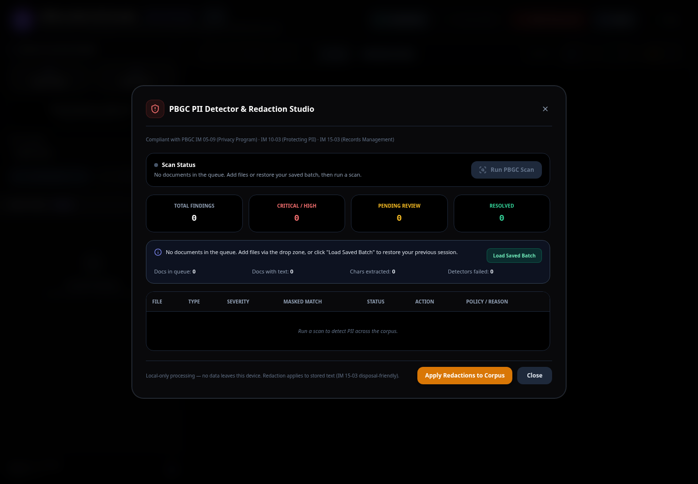
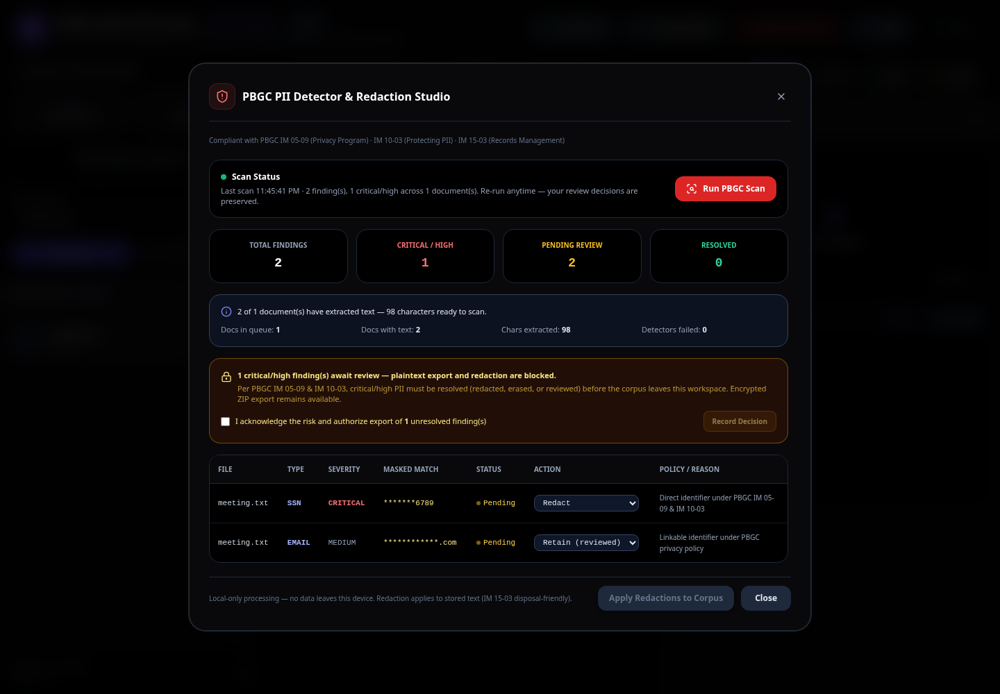

# Bulk OCR & LLM Pipeline Studio


**Bulk OCR & LLM Pipeline Studio** is a 100% client-side, browser-based document ingestion and Optical Character Recognition (OCR) studio. It ingests, parses, and packages messy multi-format document corpora into structured, schema-compliant **JSONC (JSON with Comments)** payloads ready for downstream Large Language Model (LLM) agents, Retrieval-Augmented Generation (RAG) pipelines, and automated data extraction modules — all with zero data leaving the device.

It ships in **two editions**:

| Edition | Directory | Runtime |
|---|---|---|
| **Bulk OCR Studio** | `bulk-ocr-app/` | CDN-loaded libraries (needs network for first load) |
| **Offline Bulk OCR Studio** | `o-bulk-ocr-studio/` | 100% vendored libraries — fully air-gapped, opens directly from disk |

### 🌐 Live Demo
The CDN edition is deployed at **[https://erchulo.github.io/bulk-ocr-studio/](https://erchulo.github.io/bulk-ocr-studio/)** — open it in any modern browser to try the CDN edition instantly.

---

## 🌟 What It Does, How, and Why

### 1. What It Does
* **Multi-Format Ingestion**: Ingests individual files, entire local directories, or drag-and-drop batches spanning:
  * **Images**: PNG, JPG, WEBP, BMP, TIFF, GIF (via Tesseract.js OCR, with vendored English + Spanish offline models)
  * **PDF Documents**: Multi-page PDFs (automatically split and rendered page-by-page into high-resolution canvases)
  * **Word Documents**: `.docx`, `.doc`, `.dotm`, `.docm` (macro-enabled) via mammoth.js
  * **Spreadsheets**: Excel (`.xlsx`, `.xls`) plus macro-enabled `.xlsm`/`.xlsb` via SheetJS
  * **Tabular Data**: CSV files
  * **Text & Markdown**: `.txt` and `.md` files with zero overhead
* **Per-Page Processing & Inspection**: Inspect, review, and manually edit extracted text page-by-page side-by-side with original document previews and VS Code-style file icons.
* **PBGC PII Detector & Redaction Studio**: Scans the full corpus for SSNs, EINs, bank/pension/participant identifiers, credit cards, DOBs, emails, phones, plan IDs, and credentials — then enforces PBGC IM 05-09, IM 10-03, and IM 15-03 with per-finding review, persisted decisions, one-click corpus redaction, export gates, and downloadable compliance reports.
* **AES-256 Protected ZIP Export**: PBGC-compliant password-protected (AES-256) batch export for secure offline transfer.
* **PII Compliance Report Export**: Download JSON or CSV audit logs of findings, severities, statuses, decisions, and timestamps.
* **LLM Schema & Prompt Packaging**: Embeds custom system prompts and target JSON Schemas directly into `.jsonc` exports so downstream LLMs know exactly how to validate and extract structured entities.
* **Real-Time Token Estimation**: Calculates approximate token usage in real time to ensure your batches fit within LLM context limits.
* **Acrobat-Style Low-Confidence Review Wizard**: Flags uncertain OCR words with a visual context-image crop and inline correction.

### 2. How It Works (Architecture)
* **Zero Server Calls (100% Client-Side)**: All PDF rendering (PDF.js), OCR inferencing (Tesseract.js), document parsing (mammoth.js, SheetJS), and ZIP compression/encryption (JSZip) run locally in your browser using WebAssembly and Web Workers. Your files never leave your computer.
* **Native IndexedDB Persistence**: Results auto-save to IndexedDB through a lightweight native wrapper (no external dependency). Your work survives browser refreshes and accidental tab closures, and a saved batch can be restored on the next launch.
* **`file://` Protocol Support**: The offline edition auto-detects local-disk execution and disables PDF workers / Tesseract blob workers so it runs with zero server from double-clicked `index.html` (verified on Chromium and Brave).

### 3. Why It Exists
Traditional OCR tools output flat text or fragile formats without provenance, making them difficult to pipe into LLMs. Bulk OCR Studio solves this by turning raw document folders into **self-describing, schema-validated JSONC payloads** equipped with system prompts, word counts, metadata, and comments for seamless RAG and agentic workflows — and, for restricted environments, does it entirely offline with enforced PII handling.

---

## 🛡️ PBGC PII Detector & Redaction (v1.9.0 → v1.10.0)

A built-in detector surfaces PII across the corpus with per-finding severity, masked matches, policy references, and review actions (Redact / Erase / Retain / False Positive).

### v1.10.0 — Enforcement & Review Lifecycle
* **Manual scan lifecycle**: the modal opens with a clear "not yet scanned" state; you click **Run PBGC Scan** and watch scanning feedback, instead of an invisible auto-scan on open.
* **Deterministic findings**: stable, hash-based finding IDs — your review decisions **persist across re-scans** (no more wiping after the button).
* **Enforcement gates (IM 05-09 / IM 10-03)**:
  * Plaintext exports (TXT / JSON / JSONC) are **blocked** while critical/high findings await review.
  * An **override acknowledgment** lets you record a risk decision in-session (cleared on the next scan).
  * **AES-256 ZIP export** stays available but now **requires a password** whenever unresolved findings exist.
* **Review ergonomics**: severity/status filter, bulk "Resolve all critical/high", and an **undo** path ("Set Back to Pending") for misclicks.
* **Decisions survive reload**: review choices now persist to IndexedDB, so a page refresh no longer wipes your PII review work.
* **Two-step redaction confirmation**: applying redactions now asks you to confirm ("Redact X / Erase Y in Z doc(s)") before permanently editing stored text — aligning with IM 15-03 disposal-friendly records management.
* **Compliance report export**: JSON and CSV audit reports can be downloaded directly from the PII modal.
* **Accessibility**: Esc closes modals, focus management on open, aria-live scan status, and fixed preview image handling.

---

## 🚀 Quick Start & User Guide

### Running Locally

**Offline edition (recommended, air-gapped):**
* Just double-click `o-bulk-ocr-studio/index.html` — it runs fully from `file://` with all libraries vendored locally (verified on Chromium and Brave).

**CDN edition:**
* Because browsers restrict some sub-requests on `file://` for CDN assets, serve the folder with any static server:

  1. **Using Python**:
     ```bash
     python3 -m http.server 8000
     ```
     Then open `http://localhost:8000/bulk-ocr-app/` (CDN) or `http://localhost:8000/o-bulk-ocr-studio/` (offline).
  2. **Using Node.js**:
     ```bash
     npx serve
     ```

### Step-by-Step Usage Example

1. **Select Input Source**:
   * Click **Select Folder** to point the app at an entire local directory of documents, or **Select Files** to choose individual documents.
   * Alternatively, drag and drop files/folders directly into the drop zone.
2. **Run Batch Processing**:
   * Choose your OCR language (English `eng` or Spanish `spa` offline).
   * Click **Process Queue** and watch real-time progress bars, elapsed time, and live ETA countdowns.
3. **Run the PBGC PII Scan**:
   * Open **PBGC PII Scan**, click **Run PBGC Scan**, review each finding, and apply redactions.
4. **Configure LLM Prompt & Schema (Optional)**:
   * Open **LLM Schema & Prompt**, define your system prompt and target JSON Schema (e.g., Pydantic-generated).
5. **Export**:
   * Preview and download schema-ready **JSONC**, export a password-protected **AES-256 ZIP**, or download TXT/JSON of your processed corpus.

---

## 📸 Screenshots

### PBGC PII Detector — Empty State (pre-scan)


### PBGC PII Detector — Findings with Enforcement Gate


---

## 📂 Repository Structure

```text
bulk-ocr-studio/
├── bulk-ocr-app/
│   └── index.html              # CDN edition (single-file application)
├── o-bulk-ocr-studio/
│   ├── index.html              # Offline air-gapped edition (single-file application)
│   ├── README.md               # Offline edition documentation
│   └── vendor/                 # 100% vendored libraries (zero CDN calls)
│       ├── core/               # Tesseract WASM binaries
│       ├── langs/              # eng + spa traineddata offline models
│       └── *.js                # Tesseract, PDF.js, SheetJS, mammoth, JSZip, Lucide
├── design-system/
│   └── MASTER.md               # Global design tokens and architecture standards
├── uploads/                    # Sample uploads for local testing
├── PRODUCT.md                  # Product overview and downstream consumer specs
├── DESIGN.md                   # OKLCH-aligned design system and anti-slop rules
├── LICENSE                     # MIT license
└── README.md                   # This documentation
```

---

## 📜 Version History

| Version | Highlights |
|---|---|
| **v1.10.0** | PBGC PII enforcement lifecycle: manual scan, deterministic findings, decision persistence (now persisted to IndexedDB), export gates + override, mandatory ZIP password, bulk resolve, undo, JSON/CSV compliance report export, two-step redaction confirmation, Esc/a11y polish, diagnostics fix |
| **v1.9.0** | PBGC PII Detector & Redaction Studio (IM 05-09/IM 10-03), AES-256 ZIP export, Word macro (`.docm`) + Excel macro (`.xlsm`/`.xlsb`) support, VS Code-style inspector icons, JSONC live preview, low-confidence wizard polish |
| **v1.8.0** | Offline edition maturity: vendored Tailwind + all libraries for zero-CDN air-gapped use, Spanish OCR model, timestamp naming, JSONC packaging refinements |
| **v1.7.0** | Architecture, ui-ux-pro-max, and impeccable fine-tuning pass |
| **v1.6.0** | Consistent timestamp naming, screen-size enforcement, Adobe Acrobat-style low-confidence OCR review wizard |
| **v1.5.0** | Drag-and-drop tree traversal, IndexedDB restore banner CTA, LLM schema/prompt UX overhaul with real-time validation, regex search toggle |
| **v1.4.0** | LLM Schema & Prompt injector for downstream LLM/RAG pipelines, real-time token estimator |
| **v1.3.0** | CSV, XLSX, XLS, TXT, and Markdown parsers, Dexie.js IndexedDB persistence |
| **v1.2.0** | IndexedDB persistence, drag-and-drop refinement |
| **v1.1.0** | JSONC (JSON with comments) export feature |
| **v1.0.0** | Initial Bulk OCR Studio: batch OCR, PDF splitting, image ingestion |

---

## 🛡️ License
Distributed under the **MIT License**. See [LICENSE](LICENSE). Feel free to use, modify, and integrate into your data pipelines.
